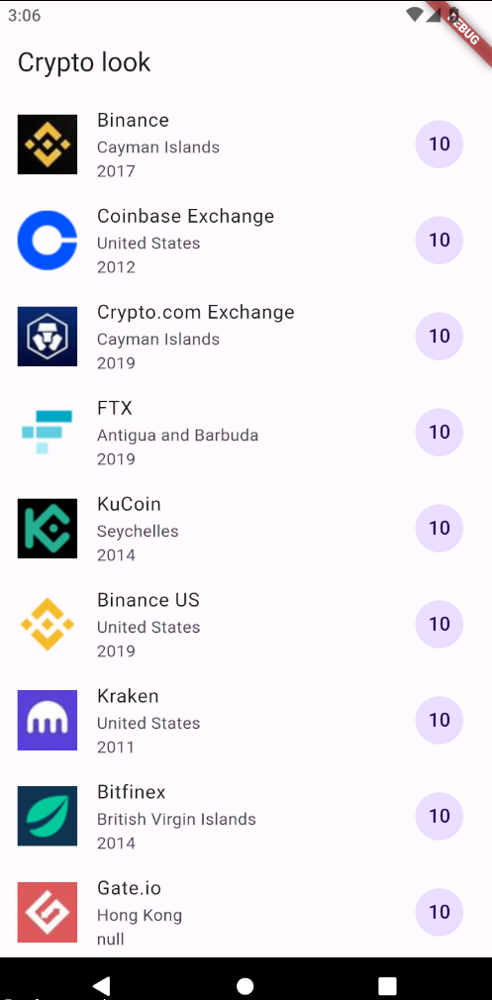

# App Crypto Look

App para practicar:
 - El uso de List View builder
 - Widget List Tile
 - Convertir datos de JSON a objeto dynamic
 - Actualizar datos de pantalla
 - Paso de parametros

## Getting Started

Recuerda que despues de clonar el proyecto, abrir una terminal dentro de la carpeta del proyecto y ejecutar el comando:

```sh
flutter packages get
``` 

## App Screenshot


